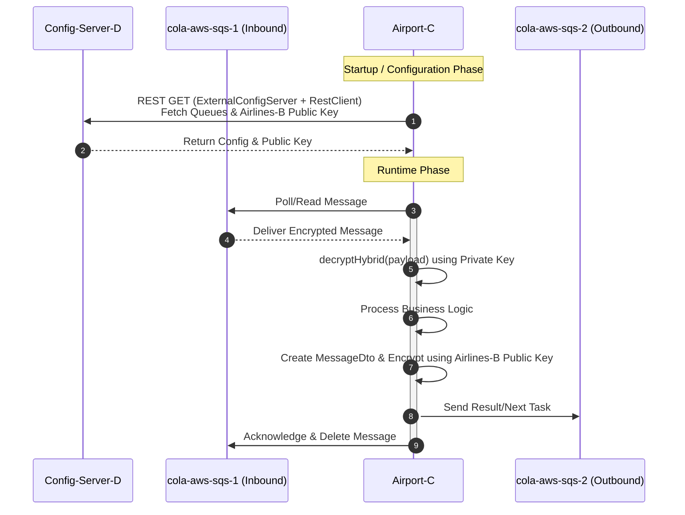

# Consumer/Producer Microservice (C)

## Airport-C Microservice (Consumer/Producer)

**Tech Stack:** Java 25, Gradle Groovy, Spring Boot 4, Spring AWS Cloud SQS.

### Overview
This microservice acts as both a consumer and a producer/listener within the distributed system. Its primary workflow involves:

1.  **Consuming:** It reads, processes, and deletes messages from `cola-aws-sqs-1`.
2.  **Decryption:** Upon reading a message from `cola-aws-sqs-1`, it decrypts the content using its private key via the `decryptHybrid` method.
3.  **Processing & Producing:**
   * It utilizes the shared library `sqs-consumer-producer-lib` (A) to act as a producer.
   * Once processing is complete, it generates a result or defines the next task.
   * It wraps this data in a `MessageDto` and sends it to `cola-aws-sqs-2` for processing by the **Airlines-B** microservice.
4.  **Security & Configuration:**
   * It retrieves the **Airlines-B Public Key** from **Config-Server-D** via REST (using `ExternalConfigServer` + `RestClient`) to encrypt the outbound payload.
   * It maintains its own Private Key locally for decrypting inbound messages.
   * It fetches SQS queue configurations (Inbound: `cola-aws-sqs-1`, Outbound: `cola-aws-sqs-2`) from **Config-Server-D**.

### Sequence Diagram



## 🚀 Execution

```bash
make clean
make build
make bootJar
make bootRun
```